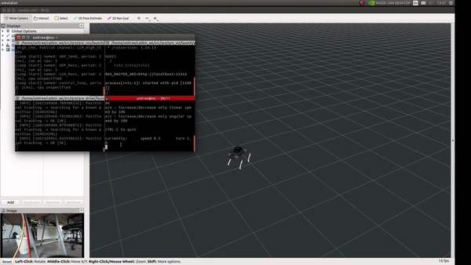

  <table>
    <tr>
      <td align="center" width="50%">
        
      </td>
      <td align="center" width="50%">
        
      </td>
    </tr>
    <tr>
      <td align="center"><strong>MYBOTSHOP GmbH</strong></td>
      <td align="center"><strong>Quadruped Robotics uG</strong></td>
    </tr>
  </table>

  <h3>Project Showcase</h3>
  <table>
    <tr>
      <td></td>
      <td></td>
      <td></td>
      <td></td>
    </tr>
    <tr>
      <td></td>
      <td></td>
      <td></td>
      <td></td>
    </tr>
    <tr>
      <td></td>
      <td></td>
      <td></td>
      <td></td>
    </tr>
    <tr>
      <td></td>
      <td></td>
      <td></td>
      <td></td>
    </tr>
  </table>

---

## MYBOTSHOP GmbH

**Website:** https://www.mybotshop.de  
**Headquarters:** Bergheim (near Cologne), North Rhine-Westphalia, Germany  
**Founded:** 2017  
**Industry:** Robotics, Automation Technology, Mechatronics  

### Overview

MYBOTSHOP GmbH is a German robotics technology company specializing in the distribution, integration, and support of robotic systems and components. The company serves industrial customers, research institutions, universities, and developers with high-quality hardware, engineering expertise, and technical resources.

### Core Capabilities

- Robotics components and platforms (actuators, sensors, controllers, development kits)
- Robotics system integration and technical consulting
- ROS-based development support
- Community forums and technical documentation

### Resources

- **Forums:** https://forum.mybotshop.de/  
- **LinkedIn:** https://www.linkedin.com/company/mybotshop/posts/?feedView=all  
- **YouTube:** https://www.youtube.com/@mybotshop  
- **Documentation:** https://www.docs.mybotshop.de/  

---

## Quadruped Robotics uG

**Website:** https://www.quadruped.de  
**Industry:** Legged Robotics, Autonomous Systems  
**Origin:** Specialized entity associated with MYBOTSHOP GmbH  

### Overview

Quadruped Robotics uG focuses on quadruped robotic platforms designed for research, industrial testing, and autonomous system development. The company emphasizes modular, ROS-compatible systems suitable for advanced locomotion, perception, and navigation research.

### Technology Highlights

- Quadruped robots with 12-DOF locomotion
- ROS and ROS 2 compatibility
- Support for SLAM, mapping, and autonomous navigation
- Modular sensor and payload integration

### Representative Platform Metrics

- **Speed:** Up to ~3.3 m/s (model-dependent)
- **Payload:** Up to ~5 kg
- **Runtime:** Up to ~2.5 hours (configuration-dependent)
- **Software Stack:** Ubuntu + ROS ecosystem

### Resources

- **Forums:** https://forum.mybotshop.de/  
- **LinkedIn:** https://www.linkedin.com/company/quadruped-robotics/posts/?feedView=all  
- **Documentation:** https://www.docs.quadruped.de/  

---

## Copyright

Copyright © 2026  
**MYBOTSHOP GmbH**

