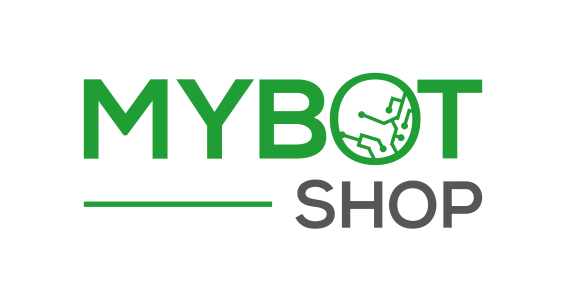

# [MYBOTSHOP GmbH](https://www.mybotshop.de/)

  

‎ 

- [Forums](https://forum.mybotshop.de/)
- [Linkedin](https://www.linkedin.com/company/mybotshop/posts/?feedView=all)
- [Youtube](https://www.youtube.com/@mybotshop)
- [Documentation](https://www.docs.mybotshop.de/)

‎ 

# [Quadruped uG](https://www.quadruped.de/)

  

‎ 

- [Forums](https://forum.mybotshop.de/)
- [Linkedin](https://www.linkedin.com/company/quadruped-robotics/posts/?feedView=all)
- [Documentation](https://www.docs.quadruped.de/)

‎ 

## Copyright 

Copyright (C) 2024 by [MYBOTSHOP GmbH](https://www.mybotshop.de/)

‎ 

<!-- 

  
  &nbsp;
  
  &nbsp; 
  

 -->
